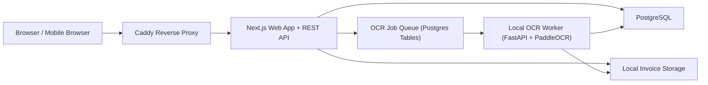

# MyFamilyExpenses Architecture Blueprint

## 1. System architecture

### Recommended architecture style

Use a modular monolith for the web application, plus one small local OCR worker service:

- `Next.js` handles UI, API, authentication, authorization, reporting, and file access.
- `PostgreSQL` stores users, categories, expenses, sessions, drafts, OCR logs, and audit history.
- Local filesystem storage stores original invoice files outside the web root.
- A local `Python OCR worker` handles OCR and field extraction because the strongest self-hosted OCR tooling is Python-first.

This keeps the deployment simple for a self-hosted personal server while still separating the OCR runtime from the main web app.

### Why this is the best fit

- Self-hosted first: no paid cloud dependency is required.
- Solo developer friendly: one main app, one database, one OCR worker.
- Clean upgrade path: local storage can later move to object storage, and OCR providers can later be swapped without rewriting the expense domain.
- Production-ready enough: authentication, audit logging, draft workflow enforcement, and background OCR jobs are designed in from the start.

### High-level component diagram



### Core request flow

1. User logs in.
2. User opens `New Expense`.
3. User must select a category first.
4. Server creates an `expense_draft` in status `CATEGORY_SELECTED`.
5. Only then does the UI allow camera capture or file upload.
6. Uploaded file is stored in a temporary draft path.
7. OCR worker processes the file and writes extracted fields plus confidence scores.
8. User reviews and edits the extracted fields.
9. User clicks `Save`.
10. Server validates reviewed fields and creates the final `expense` record.

### Workflow enforcement rule

Do not allow direct upload to `/api/expenses`.

Instead:

- `POST /api/expense-drafts` creates a draft with the selected category.
- `POST /api/expense-drafts/:id/upload` only works for a valid draft owned by the current user.
- `POST /api/expenses` only accepts a reviewed `draftId`.

This is the simplest reliable way to enforce the required business sequence.

## 2. Technology recommendation

| Layer | Recommendation | Why |
| --- | --- | --- |
| Frontend | Next.js App Router + TypeScript | One codebase for UI and API, strong DX, simple self-hosting |
| Backend | Next.js route handlers + server service layer | Avoids an unnecessary second backend service for the core app |
| Database | Self-hosted PostgreSQL 16/17 | Strong relational model, reporting-friendly, excellent Prisma support |
| ORM | Prisma | Fast development, migrations, typed queries |
| Styling | Tailwind CSS | Fast UI delivery, mobile-first, consistent design system |
| Forms and validation | React Hook Form + Zod | Good UX with strong shared validation |
| Authentication | App-owned credentials auth using Argon2id + DB-backed sessions | Best fit for local family accounts, roles, and self-hosted password reset flows |
| Reverse proxy | Caddy | Simpler HTTPS and reverse proxy setup than nginx for personal self-hosting |
| File storage | Local filesystem outside web root | Fits the self-hosted requirement and keeps costs at zero |
| OCR | Python FastAPI worker + PaddleOCR provider | Better local OCR ecosystem, PDF support, cleaner separation from Node |
| Background jobs | Postgres-backed job table | Keeps the MVP simple and avoids adding Redis first |
| Reporting | SQL aggregates via Prisma + server-side charts/tables | Simple, fast, enough for family scale |

### Key architectural decisions

#### 2.1 Next.js full-stack over split frontend/backend

Choose a single Next.js application for the MVP because:

- the business domain is small and well-bounded
- deployment is easier on a home or personal server
- Prisma, REST endpoints, and server-rendered dashboards live comfortably together

Do not split into a separate Node API unless:

- you later add multiple clients beyond the web app
- OCR and reporting loads become large
- you need independent release cycles

#### 2.2 Custom credentials auth over OAuth-first auth

For this app, a light in-app auth module is the most practical choice because requirements are:

- email + password only
- admin-created family users
- admin and standard roles
- password reset
- self-hosted deployment

This keeps the auth experience predictable and avoids provider complexity that does not help the family use case.

#### 2.3 OCR sidecar over pure Node OCR

Use a separate OCR service because:

- PaddleOCR and related document tooling are Python-first
- native OCR dependencies are easier to isolate from the Next.js runtime
- OCR failures or heavy CPU work will not destabilize the web app process

## 3. Domain model and business rules

### Primary domain entities

- `User`
- `Category`
- `ExpenseDraft`
- `Expense`
- `UserSession`
- `PasswordResetToken`
- `OcrJob`
- `OcrExtraction`
- `AuditLog`

### Core business rules

1. Every expense belongs to exactly one category.
2. Category selection must happen before scan/upload.
3. A standard user can only view and manage their own expenses.
4. An admin can view all users, all expenses, all categories, and reports across users.
5. Disabled categories remain visible on old expenses but cannot be chosen for new drafts.
6. Expense save is allowed only after user review.
7. Invoice files are never served directly from disk paths.
8. Invoice number, invoice date, and amount must be present before final save.
9. If OCR fails or confidence is low, the user can manually correct the values.
10. Deleting an expense should be a soft delete for safety and auditability.

## 4. Database schema

### Schema notes

- Use UUID primary keys.
- Use `TIMESTAMPTZ` for all timestamps.
- Use `NUMERIC(12,2)` for money values.
- Normalize emails to lowercase before write.
- Treat `invoice_number` as the user-reviewed invoice or receipt reference.

### SQL schema

```sql
CREATE EXTENSION IF NOT EXISTS pgcrypto;

CREATE TYPE user_role AS ENUM ('ADMIN', 'USER');
CREATE TYPE category_status AS ENUM ('ACTIVE', 'DISABLED');
CREATE TYPE draft_status AS ENUM (
  'CATEGORY_SELECTED',
  'FILE_UPLOADED',
  'OCR_PROCESSING',
  'REVIEW_READY',
  'COMPLETED',
  'CANCELLED',
  'EXPIRED'
);
CREATE TYPE ocr_job_status AS ENUM ('PENDING', 'PROCESSING', 'SUCCEEDED', 'FAILED');

CREATE OR REPLACE FUNCTION set_updated_at()
RETURNS TRIGGER AS $$
BEGIN
  NEW.updated_at = NOW();
  RETURN NEW;
END;
$$ LANGUAGE plpgsql;

CREATE TABLE users (
  id UUID PRIMARY KEY DEFAULT gen_random_uuid(),
  name VARCHAR(100) NOT NULL,
  email VARCHAR(320) NOT NULL,
  password_hash TEXT NOT NULL,
  role user_role NOT NULL DEFAULT 'USER',
  is_active BOOLEAN NOT NULL DEFAULT TRUE,
  must_change_password BOOLEAN NOT NULL DEFAULT FALSE,
  last_login_at TIMESTAMPTZ NULL,
  created_at TIMESTAMPTZ NOT NULL DEFAULT NOW(),
  updated_at TIMESTAMPTZ NOT NULL DEFAULT NOW()
);

CREATE UNIQUE INDEX users_email_ci_unique_idx ON users (LOWER(email));

CREATE TABLE user_sessions (
  id UUID PRIMARY KEY DEFAULT gen_random_uuid(),
  user_id UUID NOT NULL REFERENCES users(id) ON DELETE CASCADE,
  session_token_hash TEXT NOT NULL,
  ip_address INET NULL,
  user_agent TEXT NULL,
  expires_at TIMESTAMPTZ NOT NULL,
  last_used_at TIMESTAMPTZ NOT NULL DEFAULT NOW(),
  revoked_at TIMESTAMPTZ NULL,
  created_at TIMESTAMPTZ NOT NULL DEFAULT NOW()
);

CREATE UNIQUE INDEX user_sessions_token_hash_unique_idx ON user_sessions (session_token_hash);
CREATE INDEX user_sessions_user_id_idx ON user_sessions (user_id);
CREATE INDEX user_sessions_expires_at_idx ON user_sessions (expires_at);

CREATE TABLE password_reset_tokens (
  id UUID PRIMARY KEY DEFAULT gen_random_uuid(),
  user_id UUID NOT NULL REFERENCES users(id) ON DELETE CASCADE,
  token_hash TEXT NOT NULL,
  expires_at TIMESTAMPTZ NOT NULL,
  used_at TIMESTAMPTZ NULL,
  requested_ip INET NULL,
  created_at TIMESTAMPTZ NOT NULL DEFAULT NOW()
);

CREATE UNIQUE INDEX password_reset_tokens_hash_unique_idx ON password_reset_tokens (token_hash);
CREATE INDEX password_reset_tokens_user_id_idx ON password_reset_tokens (user_id);
CREATE INDEX password_reset_tokens_expires_at_idx ON password_reset_tokens (expires_at);

CREATE TABLE categories (
  id UUID PRIMARY KEY DEFAULT gen_random_uuid(),
  name VARCHAR(80) NOT NULL,
  status category_status NOT NULL DEFAULT 'ACTIVE',
  sort_order INTEGER NOT NULL CHECK (sort_order >= 0),
  created_at TIMESTAMPTZ NOT NULL DEFAULT NOW(),
  updated_at TIMESTAMPTZ NOT NULL DEFAULT NOW()
);

CREATE UNIQUE INDEX categories_name_ci_unique_idx ON categories (LOWER(name));
CREATE INDEX categories_sort_order_idx ON categories (sort_order);

CREATE TABLE expense_drafts (
  id UUID PRIMARY KEY DEFAULT gen_random_uuid(),
  user_id UUID NOT NULL REFERENCES users(id) ON DELETE CASCADE,
  category_id UUID NOT NULL REFERENCES categories(id),
  status draft_status NOT NULL DEFAULT 'CATEGORY_SELECTED',
  temp_file_path TEXT NULL,
  temp_original_filename TEXT NULL,
  temp_mime_type VARCHAR(100) NULL,
  temp_file_size_bytes BIGINT NULL CHECK (temp_file_size_bytes IS NULL OR temp_file_size_bytes >= 0),
  extracted_invoice_number VARCHAR(120) NULL,
  extracted_invoice_date DATE NULL,
  extracted_amount NUMERIC(12,2) NULL CHECK (extracted_amount IS NULL OR extracted_amount >= 0),
  field_confidence JSONB NOT NULL DEFAULT '{}'::jsonb,
  last_error TEXT NULL,
  expires_at TIMESTAMPTZ NOT NULL,
  created_at TIMESTAMPTZ NOT NULL DEFAULT NOW(),
  updated_at TIMESTAMPTZ NOT NULL DEFAULT NOW()
);

CREATE INDEX expense_drafts_user_id_idx ON expense_drafts (user_id);
CREATE INDEX expense_drafts_status_idx ON expense_drafts (status);
CREATE INDEX expense_drafts_expires_at_idx ON expense_drafts (expires_at);

CREATE TABLE ocr_jobs (
  id UUID PRIMARY KEY DEFAULT gen_random_uuid(),
  draft_id UUID NOT NULL REFERENCES expense_drafts(id) ON DELETE CASCADE,
  provider VARCHAR(50) NOT NULL,
  status ocr_job_status NOT NULL DEFAULT 'PENDING',
  attempt_number SMALLINT NOT NULL DEFAULT 1,
  started_at TIMESTAMPTZ NULL,
  completed_at TIMESTAMPTZ NULL,
  error_message TEXT NULL,
  created_at TIMESTAMPTZ NOT NULL DEFAULT NOW(),
  updated_at TIMESTAMPTZ NOT NULL DEFAULT NOW()
);

CREATE INDEX ocr_jobs_draft_id_idx ON ocr_jobs (draft_id);
CREATE INDEX ocr_jobs_status_idx ON ocr_jobs (status);

CREATE TABLE ocr_extractions (
  id UUID PRIMARY KEY DEFAULT gen_random_uuid(),
  draft_id UUID NOT NULL REFERENCES expense_drafts(id) ON DELETE CASCADE,
  ocr_job_id UUID NOT NULL REFERENCES ocr_jobs(id) ON DELETE CASCADE,
  provider VARCHAR(50) NOT NULL,
  raw_text TEXT NOT NULL,
  raw_payload JSONB NOT NULL,
  invoice_number VARCHAR(120) NULL,
  invoice_number_confidence NUMERIC(5,4) NULL,
  invoice_date DATE NULL,
  invoice_date_confidence NUMERIC(5,4) NULL,
  amount NUMERIC(12,2) NULL,
  amount_confidence NUMERIC(5,4) NULL,
  created_at TIMESTAMPTZ NOT NULL DEFAULT NOW()
);

CREATE INDEX ocr_extractions_draft_id_idx ON ocr_extractions (draft_id);
CREATE INDEX ocr_extractions_ocr_job_id_idx ON ocr_extractions (ocr_job_id);

CREATE TABLE expenses (
  id UUID PRIMARY KEY DEFAULT gen_random_uuid(),
  user_id UUID NOT NULL REFERENCES users(id),
  category_id UUID NOT NULL REFERENCES categories(id),
  ocr_extraction_id UUID NULL REFERENCES ocr_extractions(id) ON DELETE SET NULL,
  invoice_number VARCHAR(120) NOT NULL,
  invoice_date DATE NOT NULL,
  amount NUMERIC(12,2) NOT NULL CHECK (amount >= 0),
  file_path TEXT NOT NULL,
  original_filename TEXT NOT NULL,
  mime_type VARCHAR(100) NOT NULL,
  file_size_bytes BIGINT NOT NULL CHECK (file_size_bytes >= 0),
  created_at TIMESTAMPTZ NOT NULL DEFAULT NOW(),
  updated_at TIMESTAMPTZ NOT NULL DEFAULT NOW(),
  deleted_at TIMESTAMPTZ NULL,
  deleted_by_user_id UUID NULL REFERENCES users(id) ON DELETE SET NULL
);

CREATE INDEX expenses_user_date_idx ON expenses (user_id, invoice_date DESC) WHERE deleted_at IS NULL;
CREATE INDEX expenses_category_date_idx ON expenses (category_id, invoice_date DESC) WHERE deleted_at IS NULL;
CREATE INDEX expenses_invoice_number_ci_idx ON expenses (LOWER(invoice_number)) WHERE deleted_at IS NULL;
CREATE INDEX expenses_created_at_idx ON expenses (created_at DESC) WHERE deleted_at IS NULL;
CREATE INDEX expenses_amount_idx ON expenses (amount) WHERE deleted_at IS NULL;

CREATE TABLE audit_logs (
  id BIGSERIAL PRIMARY KEY,
  actor_user_id UUID NULL REFERENCES users(id) ON DELETE SET NULL,
  entity_type VARCHAR(50) NOT NULL,
  entity_id UUID NULL,
  action VARCHAR(50) NOT NULL,
  details JSONB NOT NULL DEFAULT '{}'::jsonb,
  ip_address INET NULL,
  created_at TIMESTAMPTZ NOT NULL DEFAULT NOW()
);

CREATE INDEX audit_logs_actor_user_id_idx ON audit_logs (actor_user_id);
CREATE INDEX audit_logs_entity_idx ON audit_logs (entity_type, entity_id);
CREATE INDEX audit_logs_created_at_idx ON audit_logs (created_at DESC);

CREATE TRIGGER users_set_updated_at
BEFORE UPDATE ON users
FOR EACH ROW EXECUTE FUNCTION set_updated_at();

CREATE TRIGGER categories_set_updated_at
BEFORE UPDATE ON categories
FOR EACH ROW EXECUTE FUNCTION set_updated_at();

CREATE TRIGGER expense_drafts_set_updated_at
BEFORE UPDATE ON expense_drafts
FOR EACH ROW EXECUTE FUNCTION set_updated_at();

CREATE TRIGGER ocr_jobs_set_updated_at
BEFORE UPDATE ON ocr_jobs
FOR EACH ROW EXECUTE FUNCTION set_updated_at();

CREATE TRIGGER expenses_set_updated_at
BEFORE UPDATE ON expenses
FOR EACH ROW EXECUTE FUNCTION set_updated_at();
```

### Table responsibilities

| Table | Purpose |
| --- | --- |
| `users` | Family member accounts and roles |
| `user_sessions` | Server-side sessions for login/logout and session revocation |
| `password_reset_tokens` | Password reset token lifecycle |
| `categories` | Admin-managed expense categories and order |
| `expense_drafts` | Enforced category-first workflow and pre-save review state |
| `ocr_jobs` | OCR processing queue and retry state |
| `ocr_extractions` | Raw OCR text, extracted fields, confidence, provider metadata |
| `expenses` | Final saved expense records |
| `audit_logs` | Administrative and security-sensitive audit trail |

## 5. Prisma schema outline

This is the recommended Prisma shape. Use application-side lowercase normalization for `email` and category `name`.

```prisma
enum UserRole {
  ADMIN
  USER
}

enum CategoryStatus {
  ACTIVE
  DISABLED
}

enum DraftStatus {
  CATEGORY_SELECTED
  FILE_UPLOADED
  OCR_PROCESSING
  REVIEW_READY
  COMPLETED
  CANCELLED
  EXPIRED
}

enum OcrJobStatus {
  PENDING
  PROCESSING
  SUCCEEDED
  FAILED
}

model User {
  id                 String               @id @default(uuid()) @db.Uuid
  name               String               @db.VarChar(100)
  email              String               @unique @db.VarChar(320)
  passwordHash       String               @map("password_hash")
  role               UserRole             @default(USER)
  isActive           Boolean              @default(true) @map("is_active")
  mustChangePassword Boolean              @default(false) @map("must_change_password")
  lastLoginAt        DateTime?            @map("last_login_at") @db.Timestamptz
  createdAt          DateTime             @default(now()) @map("created_at") @db.Timestamptz
  updatedAt          DateTime             @updatedAt @map("updated_at") @db.Timestamptz

  sessions           UserSession[]
  passwordResets     PasswordResetToken[]
  drafts             ExpenseDraft[]
  expenses           Expense[]            @relation("ExpenseOwner")
  deletedExpenses    Expense[]            @relation("ExpenseDeletedBy")
  auditLogs          AuditLog[]

  @@map("users")
}

model UserSession {
  id               String    @id @default(uuid()) @db.Uuid
  userId           String    @map("user_id") @db.Uuid
  sessionTokenHash String    @unique @map("session_token_hash")
  ipAddress        String?   @map("ip_address") @db.Inet
  userAgent        String?   @map("user_agent")
  expiresAt        DateTime  @map("expires_at") @db.Timestamptz
  lastUsedAt       DateTime  @default(now()) @map("last_used_at") @db.Timestamptz
  revokedAt        DateTime? @map("revoked_at") @db.Timestamptz
  createdAt        DateTime  @default(now()) @map("created_at") @db.Timestamptz

  user             User      @relation(fields: [userId], references: [id], onDelete: Cascade)

  @@index([userId])
  @@index([expiresAt])
  @@map("user_sessions")
}

model PasswordResetToken {
  id          String    @id @default(uuid()) @db.Uuid
  userId      String    @map("user_id") @db.Uuid
  tokenHash   String    @unique @map("token_hash")
  expiresAt   DateTime  @map("expires_at") @db.Timestamptz
  usedAt      DateTime? @map("used_at") @db.Timestamptz
  requestedIp String?   @map("requested_ip") @db.Inet
  createdAt   DateTime  @default(now()) @map("created_at") @db.Timestamptz

  user        User      @relation(fields: [userId], references: [id], onDelete: Cascade)

  @@index([userId])
  @@index([expiresAt])
  @@map("password_reset_tokens")
}

model Category {
  id         String          @id @default(uuid()) @db.Uuid
  name       String          @db.VarChar(80)
  status     CategoryStatus  @default(ACTIVE)
  sortOrder  Int             @map("sort_order")
  createdAt  DateTime        @default(now()) @map("created_at") @db.Timestamptz
  updatedAt  DateTime        @updatedAt @map("updated_at") @db.Timestamptz

  drafts     ExpenseDraft[]
  expenses   Expense[]

  @@index([sortOrder])
  @@map("categories")
}

model ExpenseDraft {
  id                   String         @id @default(uuid()) @db.Uuid
  userId               String         @map("user_id") @db.Uuid
  categoryId           String         @map("category_id") @db.Uuid
  status               DraftStatus    @default(CATEGORY_SELECTED)
  tempFilePath         String?        @map("temp_file_path")
  tempOriginalFilename String?        @map("temp_original_filename")
  tempMimeType         String?        @map("temp_mime_type") @db.VarChar(100)
  tempFileSizeBytes    BigInt?        @map("temp_file_size_bytes")
  extractedInvoiceNumber String?      @map("extracted_invoice_number") @db.VarChar(120)
  extractedInvoiceDate DateTime?      @map("extracted_invoice_date") @db.Date
  extractedAmount      Decimal?       @map("extracted_amount") @db.Decimal(12, 2)
  fieldConfidence      Json           @map("field_confidence")
  lastError            String?        @map("last_error")
  expiresAt            DateTime       @map("expires_at") @db.Timestamptz
  createdAt            DateTime       @default(now()) @map("created_at") @db.Timestamptz
  updatedAt            DateTime       @updatedAt @map("updated_at") @db.Timestamptz

  user                 User           @relation(fields: [userId], references: [id], onDelete: Cascade)
  category             Category       @relation(fields: [categoryId], references: [id])
  ocrJobs              OcrJob[]
  ocrExtractions       OcrExtraction[]

  @@index([userId])
  @@index([status])
  @@index([expiresAt])
  @@map("expense_drafts")
}

model OcrJob {
  id           String        @id @default(uuid()) @db.Uuid
  draftId      String        @map("draft_id") @db.Uuid
  provider     String        @db.VarChar(50)
  status       OcrJobStatus  @default(PENDING)
  attemptNumber Int          @default(1) @map("attempt_number") @db.SmallInt
  startedAt    DateTime?     @map("started_at") @db.Timestamptz
  completedAt  DateTime?     @map("completed_at") @db.Timestamptz
  errorMessage String?       @map("error_message")
  createdAt    DateTime      @default(now()) @map("created_at") @db.Timestamptz
  updatedAt    DateTime      @updatedAt @map("updated_at") @db.Timestamptz

  draft        ExpenseDraft  @relation(fields: [draftId], references: [id], onDelete: Cascade)
  extractions  OcrExtraction[]

  @@index([draftId])
  @@index([status])
  @@map("ocr_jobs")
}

model OcrExtraction {
  id                      String      @id @default(uuid()) @db.Uuid
  draftId                 String      @map("draft_id") @db.Uuid
  ocrJobId                String      @map("ocr_job_id") @db.Uuid
  provider                String      @db.VarChar(50)
  rawText                 String      @map("raw_text")
  rawPayload              Json        @map("raw_payload")
  invoiceNumber           String?     @map("invoice_number") @db.VarChar(120)
  invoiceNumberConfidence Decimal?    @map("invoice_number_confidence") @db.Decimal(5, 4)
  invoiceDate             DateTime?   @map("invoice_date") @db.Date
  invoiceDateConfidence   Decimal?    @map("invoice_date_confidence") @db.Decimal(5, 4)
  amount                  Decimal?    @db.Decimal(12, 2)
  amountConfidence        Decimal?    @map("amount_confidence") @db.Decimal(5, 4)
  createdAt               DateTime    @default(now()) @map("created_at") @db.Timestamptz

  draft                   ExpenseDraft @relation(fields: [draftId], references: [id], onDelete: Cascade)
  ocrJob                  OcrJob       @relation(fields: [ocrJobId], references: [id], onDelete: Cascade)
  expenses                Expense[]

  @@index([draftId])
  @@index([ocrJobId])
  @@map("ocr_extractions")
}

model Expense {
  id               String       @id @default(uuid()) @db.Uuid
  userId           String       @map("user_id") @db.Uuid
  categoryId       String       @map("category_id") @db.Uuid
  ocrExtractionId  String?      @map("ocr_extraction_id") @db.Uuid
  invoiceNumber    String       @map("invoice_number") @db.VarChar(120)
  invoiceDate      DateTime     @map("invoice_date") @db.Date
  amount           Decimal      @db.Decimal(12, 2)
  filePath         String       @map("file_path")
  originalFilename String       @map("original_filename")
  mimeType         String       @map("mime_type") @db.VarChar(100)
  fileSizeBytes    BigInt       @map("file_size_bytes")
  createdAt        DateTime     @default(now()) @map("created_at") @db.Timestamptz
  updatedAt        DateTime     @updatedAt @map("updated_at") @db.Timestamptz
  deletedAt        DateTime?    @map("deleted_at") @db.Timestamptz
  deletedByUserId  String?      @map("deleted_by_user_id") @db.Uuid

  user             User         @relation("ExpenseOwner", fields: [userId], references: [id])
  category         Category     @relation(fields: [categoryId], references: [id])
  ocrExtraction    OcrExtraction? @relation(fields: [ocrExtractionId], references: [id], onDelete: SetNull)
  deletedByUser    User?        @relation("ExpenseDeletedBy", fields: [deletedByUserId], references: [id], onDelete: SetNull)

  @@index([userId, invoiceDate(sort: Desc)])
  @@index([categoryId, invoiceDate(sort: Desc)])
  @@index([createdAt(sort: Desc)])
  @@index([amount])
  @@map("expenses")
}

model AuditLog {
  id          BigInt    @id @default(autoincrement())
  actorUserId String?   @map("actor_user_id") @db.Uuid
  entityType  String    @map("entity_type") @db.VarChar(50)
  entityId    String?   @map("entity_id") @db.Uuid
  action      String    @db.VarChar(50)
  details     Json
  ipAddress   String?   @map("ip_address") @db.Inet
  createdAt   DateTime  @default(now()) @map("created_at") @db.Timestamptz

  actorUser   User?     @relation(fields: [actorUserId], references: [id], onDelete: SetNull)

  @@index([actorUserId])
  @@index([entityType, entityId])
  @@index([createdAt(sort: Desc)])
  @@map("audit_logs")
}
```

## 6. Recommended folder structure

```text
MyFamilyExpenses/
├─ docs/
│  ├─ architecture.md
│  ├─ development-roadmap.md
│  └─ deployment-self-hosted.md
├─ prisma/
│  ├─ schema.prisma
│  ├─ migrations/
│  └─ seed.ts
├─ public/
├─ src/
│  ├─ app/
│  │  ├─ (auth)/
│  │  │  ├─ login/page.tsx
│  │  │  ├─ forgot-password/page.tsx
│  │  │  └─ reset-password/page.tsx
│  │  ├─ (app)/
│  │  │  ├─ dashboard/page.tsx
│  │  │  ├─ expenses/
│  │  │  │  ├─ new/category/page.tsx
│  │  │  │  ├─ new/upload/page.tsx
│  │  │  │  ├─ new/review/page.tsx
│  │  │  │  ├─ history/page.tsx
│  │  │  │  └─ [id]/page.tsx
│  │  │  ├─ reports/page.tsx
│  │  │  ├─ profile/page.tsx
│  │  │  └─ admin/
│  │  │     ├─ categories/page.tsx
│  │  │     └─ users/page.tsx
│  │  └─ api/
│  │     ├─ auth/
│  │     ├─ users/
│  │     ├─ categories/
│  │     ├─ expense-drafts/
│  │     ├─ expenses/
│  │     └─ reports/
│  ├─ components/
│  │  ├─ ui/
│  │  ├─ layout/
│  │  ├─ dashboard/
│  │  ├─ expenses/
│  │  ├─ reports/
│  │  └─ admin/
│  ├─ features/
│  │  ├─ auth/
│  │  ├─ users/
│  │  ├─ categories/
│  │  ├─ expenses/
│  │  ├─ reports/
│  │  └─ dashboard/
│  ├─ lib/
│  │  ├─ auth/
│  │  ├─ db/
│  │  ├─ permissions/
│  │  ├─ validation/
│  │  ├─ storage/
│  │  ├─ audit/
│  │  ├─ pagination/
│  │  └─ utils/
│  ├─ server/
│  │  ├─ repositories/
│  │  ├─ services/
│  │  │  ├─ auth/
│  │  │  ├─ categories/
│  │  │  ├─ expenses/
│  │  │  ├─ reports/
│  │  │  └─ ocr/
│  │  │     ├─ adapters/
│  │  │     ├─ parsers/
│  │  │     └─ jobs/
│  │  └─ policies/
│  ├─ styles/
│  └─ middleware.ts
├─ services/
│  └─ ocr-worker/
│     ├─ app/
│     │  ├─ main.py
│     │  ├─ providers/
│     │  ├─ extractors/
│     │  ├─ preprocess/
│     │  └─ schemas/
│     ├─ requirements.txt
│     └─ Dockerfile
├─ storage/
│  └─ .gitkeep
├─ tests/
│  ├─ unit/
│  ├─ integration/
│  └─ e2e/
├─ docker/
│  ├─ web.Dockerfile
│  ├─ ocr-worker.Dockerfile
│  └─ Caddyfile
├─ .env.example
└─ package.json
```

### Structure rules

- Keep domain logic in `src/server/services`, not inside route handlers.
- Keep Prisma calls in repositories or service boundaries.
- Keep storage operations in `lib/storage`.
- Keep OCR provider contracts isolated from the rest of the expense domain.

## 7. UI layout and screen descriptions

### Global UX direction

- Mobile-first, large tap targets, minimal text.
- One primary action per screen.
- Use a 3-step expense wizard with visible progress:
  - `1. Category`
  - `2. Upload`
  - `3. Review`
- Keep navigation simple:
  - Dashboard
  - New Expense
  - History
  - Reports
  - Admin for admins only

### Screen-by-screen blueprint

#### Login page

- Simple email and password form
- `Forgot password` link
- Large `Sign in` button
- Friendly empty state text

#### Dashboard

- Cards:
  - total today
  - total this month
  - top categories this month
- Recent invoices list
- Large sticky `Add Expense` button

#### Select Category screen

- Grid or stacked list of active categories
- Search box only if category list grows beyond 12-15 entries
- Selected category highlighted clearly
- Continue button disabled until a category is selected

#### Scan Invoice screen

- Camera capture button
- Upload image/PDF button
- Short helper text:
  - `Step 1 complete: category selected`
- Show selected category at the top
- Do not show upload controls if no draft exists

#### Review Extracted Data screen

- File preview at the top
- Editable fields:
  - invoice number
  - invoice date
  - amount
  - category
- Confidence indicators:
  - green for high confidence
  - amber for medium
  - red for missing/low confidence
- `Save Expense` primary button
- `Retake / Replace File` secondary action

#### Expense History page

- Filters:
  - invoice number
  - single date
  - date range
  - category
  - user for admins
  - amount range
- Sortable table/list
- Mobile cards on small screens
- File preview action for each item

#### Reports page

- Date range picker
- Summary total
- Totals by category
- Totals by user
- Monthly totals chart
- Export CSV later, not required for MVP

#### Admin Category Management page

- Reorder categories
- Add category
- Edit category
- Disable category
- Show which categories are disabled but still referenced historically

#### User Management page

- User list with role and status
- Create user
- Edit user
- Disable user
- Reset password

## 8. REST API design

### API standards

- Base path: `/api`
- Response envelope on success:

```json
{
  "data": {},
  "meta": {}
}
```

- Response envelope on error:

```json
{
  "error": {
    "code": "VALIDATION_ERROR",
    "message": "Request validation failed",
    "fieldErrors": {
      "email": ["Email is required"]
    }
  }
}
```

- Auth: secure HTTP-only cookie session
- Pagination defaults:
  - `page=1`
  - `pageSize=20`
  - max `pageSize=100`

### Additional recommended endpoints for enforced workflow

These are required even though they were not in the minimum list:

- `POST /api/expense-drafts`
- `GET /api/expense-drafts/:id`
- `POST /api/expense-drafts/:id/upload`
- `POST /api/expense-drafts/:id/reprocess`
- `DELETE /api/expense-drafts/:id`
- `GET /api/expenses/:id/file`

### Authentication endpoints

#### POST /api/auth/login

| Item | Details |
| --- | --- |
| Purpose | Authenticate with email and password and create a server-side session |
| Request | `{ "email": "user@example.com", "password": "string" }` |
| Response | `200` with user summary and session expiry |
| Permissions | Public |
| Validation | Valid email format, password required, rate limited, generic error on failure |

#### POST /api/auth/logout

| Item | Details |
| --- | --- |
| Purpose | Revoke current session and clear session cookie |
| Request | No body |
| Response | `200 { "data": { "success": true } }` |
| Permissions | Authenticated user |
| Validation | Current session must exist or be safely ignored |

#### POST /api/auth/forgot-password

| Item | Details |
| --- | --- |
| Purpose | Start self-service password reset when SMTP is configured |
| Request | `{ "email": "user@example.com" }` |
| Response | Always `200 { "data": { "message": "If the account exists, reset instructions have been sent." } }` |
| Permissions | Public |
| Validation | Valid email format, generic response to prevent enumeration, rate limited per IP and email |

#### POST /api/auth/reset-password

| Item | Details |
| --- | --- |
| Purpose | Complete password reset with token |
| Request | `{ "token": "raw-token", "newPassword": "string" }` |
| Response | `200 { "data": { "success": true } }` |
| Permissions | Public |
| Validation | Token must be valid, unused, unexpired; password must meet policy |

### Category endpoints

#### GET /api/categories

| Item | Details |
| --- | --- |
| Purpose | List categories in display order |
| Request | Optional query: `includeDisabled=true` for admin |
| Response | Ordered category list |
| Permissions | Authenticated user; only admins can include disabled categories |
| Validation | Non-admins cannot request disabled categories for creation flow |

#### POST /api/categories

| Item | Details |
| --- | --- |
| Purpose | Create a category |
| Request | `{ "name": "Groceries", "sortOrder": 3 }` |
| Response | Created category |
| Permissions | Admin only |
| Validation | Unique name, trimmed length, sort order >= 0 |

#### PUT /api/categories/:id

| Item | Details |
| --- | --- |
| Purpose | Rename or reorder a category |
| Request | `{ "name": "Household", "sortOrder": 5 }` |
| Response | Updated category |
| Permissions | Admin only |
| Validation | Unique name, valid category id, disabled category can still be renamed/reordered |

#### PATCH /api/categories/:id/status

| Item | Details |
| --- | --- |
| Purpose | Activate or disable a category |
| Request | `{ "status": "ACTIVE" }` or `{ "status": "DISABLED" }` |
| Response | Updated category status |
| Permissions | Admin only |
| Validation | Valid enum, category must exist |

### User endpoints

#### GET /api/users

| Item | Details |
| --- | --- |
| Purpose | List users |
| Request | Optional query: `status=active|inactive`, `page`, `pageSize` |
| Response | Paginated user list |
| Permissions | Admin only |
| Validation | Pagination bounds enforced |

#### POST /api/users

| Item | Details |
| --- | --- |
| Purpose | Create a new user |
| Request | `{ "name": "Alex", "email": "alex@example.com", "password": "string", "role": "USER" }` |
| Response | Created user summary |
| Permissions | Admin only |
| Validation | Unique email, password policy, valid role |

#### PUT /api/users/:id

| Item | Details |
| --- | --- |
| Purpose | Update user profile or role |
| Request | `{ "name": "Alex Smith", "role": "ADMIN", "isActive": true }` |
| Response | Updated user summary |
| Permissions | Admin only, except `/api/me` would be used for self-profile later |
| Validation | Prevent deleting own last admin privileges without another admin present |

### Draft workflow endpoints

#### POST /api/expense-drafts

| Item | Details |
| --- | --- |
| Purpose | Start the new expense workflow after category selection |
| Request | `{ "categoryId": "uuid" }` |
| Response | Draft id and next step URL |
| Permissions | Authenticated user |
| Validation | Category must exist and be `ACTIVE`, user must be allowed to use it |

#### GET /api/expense-drafts/:id

| Item | Details |
| --- | --- |
| Purpose | Read draft status and OCR results |
| Request | No body |
| Response | Draft status, extracted fields, confidence, errors |
| Permissions | Draft owner or admin |
| Validation | Draft must exist and not belong to another standard user |

#### POST /api/expense-drafts/:id/upload

| Item | Details |
| --- | --- |
| Purpose | Upload invoice file and queue OCR |
| Request | `multipart/form-data` with file |
| Response | Draft status `OCR_PROCESSING` and job id |
| Permissions | Draft owner or admin |
| Validation | Draft status must be `CATEGORY_SELECTED`; allowed types `image/jpeg`, `image/png`, `image/webp`, `application/pdf`; size limit enforced |

#### POST /api/expense-drafts/:id/reprocess

| Item | Details |
| --- | --- |
| Purpose | Retry OCR on the existing file |
| Request | No body |
| Response | New OCR job id |
| Permissions | Draft owner or admin |
| Validation | File must already exist for draft; retry cap enforced |

#### DELETE /api/expense-drafts/:id

| Item | Details |
| --- | --- |
| Purpose | Cancel draft and clean up temporary file |
| Request | No body |
| Response | `204 No Content` |
| Permissions | Draft owner or admin |
| Validation | Safe idempotent cleanup |

### Expense endpoints

#### GET /api/expenses

| Item | Details |
| --- | --- |
| Purpose | Search and browse expenses |
| Request | Query params: `invoiceNumber`, `date`, `fromDate`, `toDate`, `categoryId`, `userId`, `minAmount`, `maxAmount`, `sortBy`, `sortDir`, `page`, `pageSize` |
| Response | Paginated expenses list with preview metadata |
| Permissions | Users see own expenses; admins can filter by any user |
| Validation | Date ranges must be valid; amount range must be sane; non-admin `userId` filter ignored unless self |

#### GET /api/expenses/:id

| Item | Details |
| --- | --- |
| Purpose | Get expense detail |
| Request | No body |
| Response | Expense detail plus file preview URL |
| Permissions | Owner or admin |
| Validation | Expense must exist and not be soft-deleted |

#### POST /api/expenses

| Item | Details |
| --- | --- |
| Purpose | Save final reviewed expense from a completed draft |
| Request | `{ "draftId": "uuid", "invoiceNumber": "INV-1002", "invoiceDate": "2026-04-22", "amount": 54.90 }` |
| Response | Created expense |
| Permissions | Draft owner or admin |
| Validation | Draft must belong to caller, have uploaded file, have completed OCR or manual review state, all required fields valid |

#### PUT /api/expenses/:id

| Item | Details |
| --- | --- |
| Purpose | Edit an existing expense |
| Request | `{ "categoryId": "uuid", "invoiceNumber": "INV-1002", "invoiceDate": "2026-04-22", "amount": 49.90 }` |
| Response | Updated expense |
| Permissions | Owner or admin |
| Validation | Category must exist; amount >= 0; invoice number required; invoice date valid |

#### DELETE /api/expenses/:id

| Item | Details |
| --- | --- |
| Purpose | Soft delete an expense |
| Request | No body |
| Response | `204 No Content` |
| Permissions | Owner or admin, depending on final policy |
| Validation | Already deleted expense returns idempotent success |

#### GET /api/expenses/:id/file

| Item | Details |
| --- | --- |
| Purpose | Stream invoice file securely for preview/download |
| Request | No body |
| Response | File stream with correct content type |
| Permissions | Owner or admin |
| Validation | Resolve file path from DB only, never accept arbitrary path input |

### Report endpoints

#### GET /api/reports/summary

| Item | Details |
| --- | --- |
| Purpose | Total expenses in a date range |
| Request | Query: `fromDate`, `toDate`, optional `userId` |
| Response | `{ "total": 1234.56, "count": 27 }` |
| Permissions | User for own data, admin for all or selected user |
| Validation | Valid date range, user scope enforced |

#### GET /api/reports/by-category

| Item | Details |
| --- | --- |
| Purpose | Totals grouped by category |
| Request | Query: `fromDate`, `toDate`, optional `userId` |
| Response | Array of category totals |
| Permissions | Same as summary |
| Validation | Same as summary |

#### GET /api/reports/by-user

| Item | Details |
| --- | --- |
| Purpose | Totals grouped by user |
| Request | Query: `fromDate`, `toDate` |
| Response | Array of user totals |
| Permissions | Admin only |
| Validation | Valid date range |

#### GET /api/reports/monthly

| Item | Details |
| --- | --- |
| Purpose | Totals grouped by month |
| Request | Query: `fromDate`, `toDate`, optional `userId` |
| Response | Array like `{ "month": "2026-04", "total": 560.00 }` |
| Permissions | Same as summary |
| Validation | Range should be bounded, such as max 24 months for MVP |

## 9. OCR and AI workflow

### MVP local-first recommendation

Use this stack first:

- `PaddleOCR` as the primary OCR engine
- `FastAPI` as the OCR worker HTTP interface
- Postgres-backed OCR jobs
- Rule-based field extraction over OCR text

### Why PaddleOCR is the right MVP choice

- Better local document OCR capability than a browser-only OCR approach
- Supports local image and PDF inputs
- Easier to run on a self-hosted CPU-only box than building a cloud-first document AI dependency into the MVP

### Why not use Tesseract as the primary provider

Tesseract is still useful, but it is not the best primary choice here:

- it is strongest with image files, not direct PDF handling
- invoices and receipts often need stronger layout handling than plain OCR alone

### OCR pipeline

1. User uploads image or PDF to a draft.
2. API validates file size, type, and ownership.
3. File is written to a temporary draft path.
4. API creates an `ocr_job`.
5. OCR worker picks the job.
6. Worker preprocesses the file:
   - normalize orientation
   - optional deskew
   - optional resize for OCR
7. Worker runs OCR.
8. Worker extracts candidate fields:
   - invoice number
   - invoice date
   - total amount
9. Worker assigns confidence per field.
10. Worker stores raw OCR text and structured extraction.
11. Draft becomes `REVIEW_READY`.
12. UI shows extracted values and allows edits.
13. Final save only happens after explicit user approval.

### Field extraction logic

Use deterministic extraction rules first:

- Invoice number:
  - look for labels such as `invoice`, `invoice no`, `invoice #`, `receipt`, `receipt #`
  - fall back to strong alphanumeric candidates near these labels
- Invoice date:
  - parse candidates near `date`, `invoice date`, `issued`
  - choose the highest-confidence valid date not in the future beyond a small tolerance
- Total amount:
  - prioritize labels such as `total`, `grand total`, `amount due`, `invoice total`
  - avoid subtotal and tax when a better total exists

### Confidence model

Store confidence per field in `field_confidence`, for example:

```json
{
  "invoiceNumber": 0.87,
  "invoiceDate": 0.71,
  "amount": 0.94
}
```

Recommended thresholds:

- `>= 0.85`: high confidence, green indicator
- `0.60 - 0.84`: medium confidence, amber indicator
- `< 0.60`: low confidence, red indicator and focus user attention

### OCR failure handling

If OCR fails:

- keep the draft alive
- show the original file preview
- allow manual entry of all required fields
- log failure reason in `ocr_jobs` and `expense_drafts.last_error`

### Future OCR upgrade options

Keep the OCR boundary behind an interface like:

```ts
interface OcrProvider {
  process(input: {
    filePath: string;
    mimeType: string;
  }): Promise<{
    rawText: string;
    invoiceNumber?: string;
    invoiceDate?: string;
    amount?: number;
    confidence: Record<string, number>;
    rawPayload: unknown;
  }>;
}
```

Future providers:

- `Tesseract/OCRmyPDF` for searchable PDF archival and fallback OCR
- `Amazon Textract` for expense-specific extraction
- `Google Document AI` for invoice-focused extraction
- `Azure AI Document Intelligence` for structured invoice/receipt parsing
- local LLM-assisted post-processing later if needed

## 10. Validation rules

### Authentication

- Email:
  - required
  - lowercase before save
  - max 320 chars
- Password:
  - minimum 12 chars
  - allow long passphrases
  - no silent truncation

### Categories

- Name required
- Trimmed length 2-80
- Unique case-insensitive
- `sortOrder` integer >= 0

### File upload

- Allowed MIME types:
  - `image/jpeg`
  - `image/png`
  - `image/webp`
  - `application/pdf`
- Max upload size for MVP: `15 MB`
- One file per expense draft
- Reject double extensions and suspicious filenames

### Expense review and save

- `draftId` required
- `invoiceNumber` required after review
- `invoiceDate` required and must be valid
- `amount` required and must be `>= 0`
- `categoryId` must match an active or historically valid category

### Search and reports

- `fromDate <= toDate`
- `minAmount <= maxAmount`
- `page >= 1`
- `1 <= pageSize <= 100`
- `sortBy` restricted to whitelist:
  - `invoiceDate`
  - `createdAt`
  - `amount`
  - `invoiceNumber`

## 11. Security considerations

### Authentication security

- Hash passwords with `Argon2id`
- Store only hashed session tokens in the database
- Use HTTP-only, Secure, SameSite=Lax cookies
- Rotate session tokens on login and password reset
- Expire idle sessions
- Support forced logout by session revocation

### Authorization

- Enforce owner-or-admin checks in service layer, not just UI
- Never trust `userId` coming from the client for standard users
- Keep all report endpoints permission-scoped

### File upload safety

- Validate extension, MIME type, and file signature
- Rename files to generated server names
- Store files outside public web root
- Serve files only through authenticated route handlers
- Cap file size and reject oversized uploads early
- Optionally run antivirus scan if available on the host

### Storage safety

- Store final invoices under deterministic generated paths, for example:

```text
/var/lib/myfamilyexpenses/invoices/2026/04/<expense-id>.pdf
```

- Keep temporary drafts in a separate temp path
- Never use user-supplied filenames as storage paths
- Restrict directory permissions to the app user only

### Web security

- Enable CSRF protection on state-changing requests
- Add `Content-Security-Policy`
- Add `X-Frame-Options: DENY`
- Add `X-Content-Type-Options: nosniff`
- Add `Referrer-Policy: strict-origin-when-cross-origin`
- Add strict `Cache-Control: no-store` on authenticated sensitive responses where appropriate

### Rate limiting

Recommended starting limits:

- login: `5 attempts / 15 minutes / IP + email`
- forgot password: `3 requests / hour / email`
- uploads: `30 requests / hour / user`
- reports: `60 requests / hour / user`

### Password reset

- Use single-use random reset tokens
- Store only token hashes
- Expire tokens in 30-60 minutes
- Return identical responses for existing and non-existing emails

### Auditability

Write audit logs for:

- login success/failure
- logout
- password reset request/complete
- user create/update/disable
- category create/update/status change
- expense create/update/delete

### Backup and restore

- Back up the database and invoice files separately
- Test restore monthly
- Keep at least one offline or external backup copy

## 12. MVP scope vs future enhancements

### MVP scope

- Local accounts with admin and user roles
- Category management
- Category-first expense capture flow
- Image/PDF upload
- Local OCR extraction for invoice number, date, and total
- Manual review before save
- Expense history with filtering, sorting, pagination
- Dashboard summaries
- Reports by date, category, user, and month
- Self-hosted deployment with local storage

### Post-MVP enhancements

- Email delivery for self-service password reset if not enabled initially
- OCR retry tuning and vendor-specific extraction rules
- CSV export and scheduled backup reminders
- Receipt line-item extraction
- Multi-currency support
- Budgeting and alerts
- MFA for admin accounts
- Object storage support
- External document AI provider support
- Mobile PWA features and offline draft capture

## 13. Reference notes

These sources directly informed the self-hosting and OCR recommendations:

- Next.js self-hosting guide: [nextjs.org/docs/pages/guides/self-hosting](https://nextjs.org/docs/pages/guides/self-hosting)
- Prisma PostgreSQL support: [docs.prisma.io/docs/orm/core-concepts/supported-databases/postgresql](https://docs.prisma.io/docs/orm/core-concepts/supported-databases/postgresql)
- Caddy automatic HTTPS: [caddyserver.com/docs/automatic-https](https://caddyserver.com/docs/automatic-https)
- PaddleOCR installation: [paddleocr.ai/main/en/version3.x/installation.html](https://www.paddleocr.ai/main/en/version3.x/installation.html)
- PaddleOCR text detection and input support: [paddleocr.ai/main/en/version3.x/module_usage/text_detection.html](https://www.paddleocr.ai/main/en/version3.x/module_usage/text_detection.html)
- Tesseract project documentation: [github.com/tesseract-ocr/tesseract](https://github.com/tesseract-ocr/tesseract)
- PostgreSQL backup guidance: [postgresql.org/docs/17/backup-dump.html](https://www.postgresql.org/docs/17/backup-dump.html) and [postgresql.org/docs/current/app-pgdump.html](https://www.postgresql.org/docs/current/app-pgdump.html)
- OWASP password storage: [cheatsheetseries.owasp.org/cheatsheets/Password_Storage_Cheat_Sheet.html](https://cheatsheetseries.owasp.org/cheatsheets/Password_Storage_Cheat_Sheet.html)
- OWASP session management: [cheatsheetseries.owasp.org/cheatsheets/Session_Management_Cheat_Sheet.html](https://cheatsheetseries.owasp.org/cheatsheets/Session_Management_Cheat_Sheet.html)
- OWASP file upload: [cheatsheetseries.owasp.org/cheatsheets/File_Upload_Cheat_Sheet.html](https://cheatsheetseries.owasp.org/cheatsheets/File_Upload_Cheat_Sheet.html)
- OWASP forgot password: [cheatsheetseries.owasp.org/cheatsheets/Forgot_Password_Cheat_Sheet.html](https://cheatsheetseries.owasp.org/cheatsheets/Forgot_Password_Cheat_Sheet.html)
